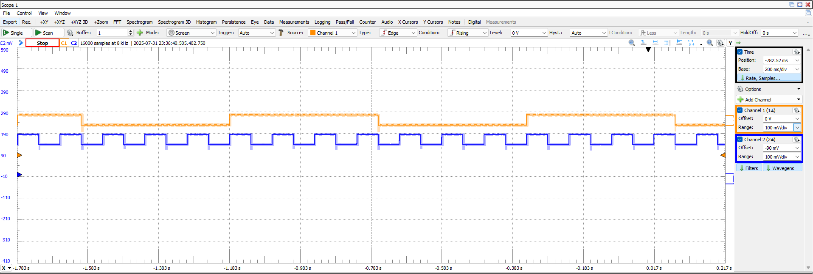
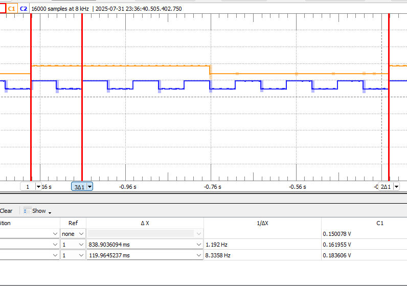
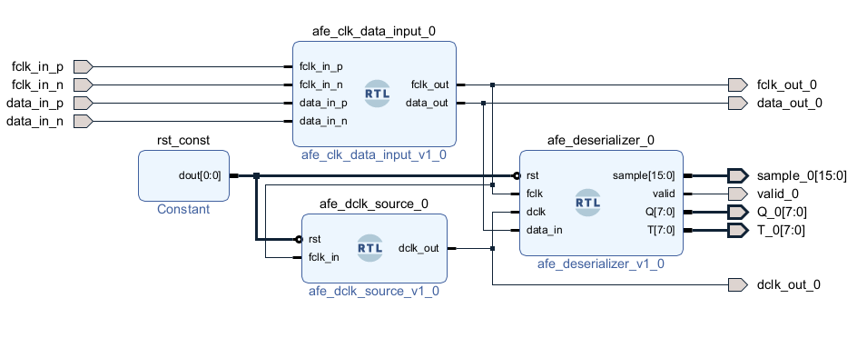
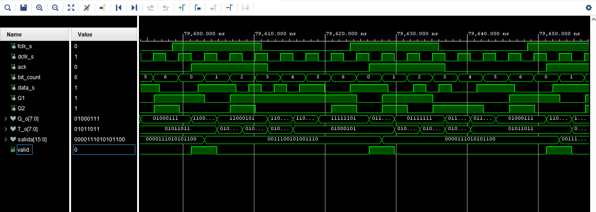
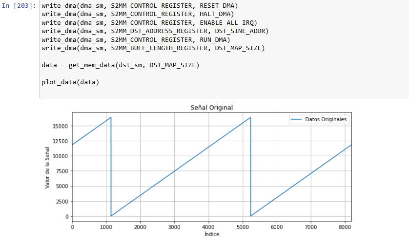
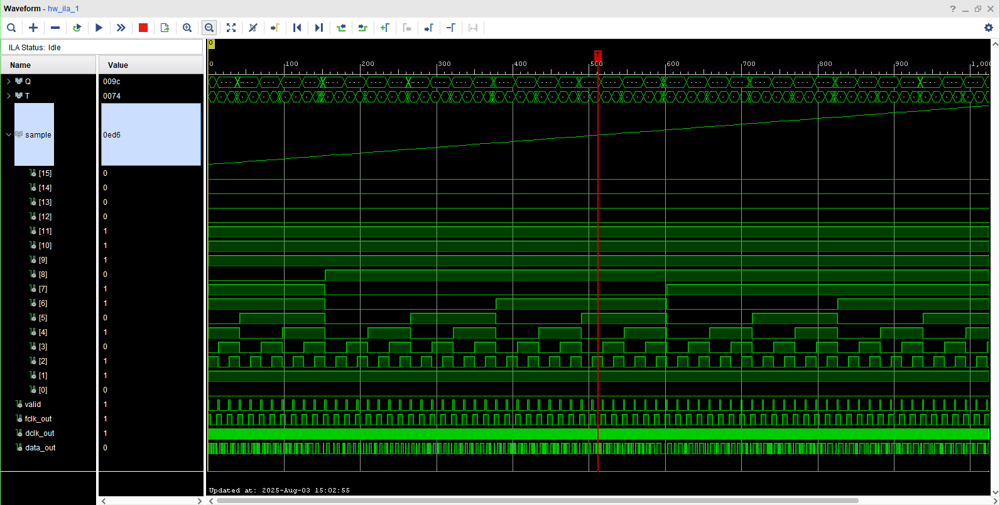
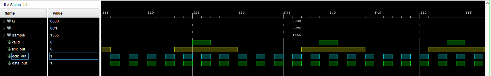
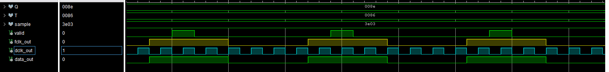
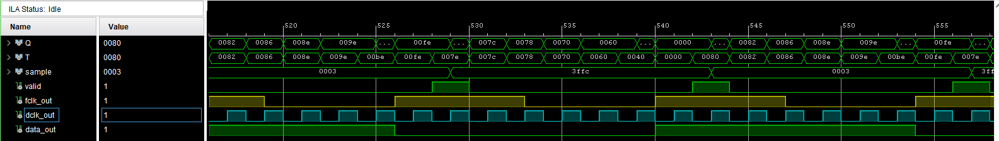
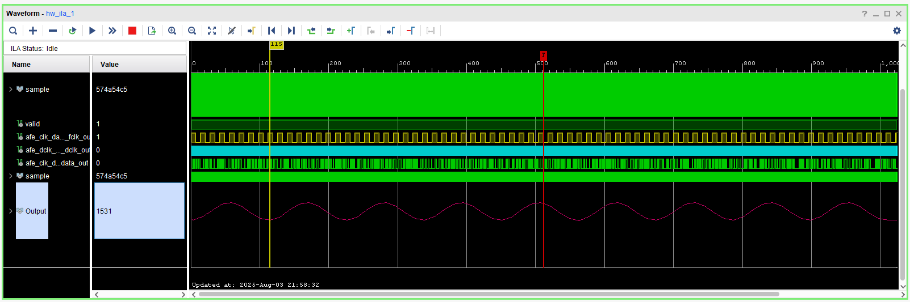

Claro, aquí tienes un resumen en formato **Markdown** de todas las pruebas y configuraciones que has realizado hasta ahora para la captura de datos del AFE5808A usando una FPGA Kria (Zynq UltraScale+), incluyendo el uso de FCLK y DCLK:

---

# 🧪 Pruebas y desarrollo para la captura DDR del AFE5808A

## 🔌 Entradas desde el AFE5808A

* **FCLK** : señal diferencial de frame clock (1 pulso por muestra).
* **DOUT1** : datos en modo DDR diferencial.
* **Modo requerido** : DDR diferencial, 14 bits por muestra, capturados como 1 bit por flanco de reloj de 7 ciclos de DCLK por FCLK.

---

## ✅ Prueba 1: Verificar llegada de FCLK

* Se conectó `FCLK` a pines del banco HPB de la Kria.
* Se instanció un `IBUFDS` para convertir de diferencial a señal lógica:
  ```vhdl
  ibufds_inst : IBUFDS
      generic map (
          DIFF_TERM => TRUE,
          IOSTANDARD => "LVDS"
      )
      port map (
          I  => fclk_in_p,
          IB => fclk_in_n,
          O  => clk_lvds
      );
  ```
* Se usó un contador con `clk_lvds` para hacer parpadear un LED, confirmando la recepción de la señal.

---

## ✅ Prueba 2: Generación de DCLK a partir de FCLK

* Se creó un módulo `dclk_generator` que:
  * Usa un `BUFG` para estabilizar `FCLK`.
  * Usa `MMCME2_BASE` para generar `DCLK = FCLK × 7`.
  * Incluye la realimentación del reloj mediante otro `BUFG`.

### Ejemplo de configuración para FCLK = 40 MHz:

```vhdl
CLKIN1_PERIOD => 25.0,        -- 40 MHz = 25 ns
CLKFBOUT_MULT_F => 21.0,
CLKOUT0_DIVIDE_F => 3.0       -- 280 MHz output
```

---

## ⚠ Ajuste dinámico de frecuencia

* Se identificó que el MMCM debe mantener una relación de 7:1 entre DCLK y FCLK:

  DCLK=FCLK×7DCLK = FCLK × 7
* Para permitir pruebas con FCLK = 5 MHz:

  * `CLKIN1_PERIOD => 200.0`
  * `CLKFBOUT_MULT_F => 7.0`
  * `CLKOUT0_DIVIDE_F => 1.0`

---

## 🧩 Recomendación de arquitectura

* Usar un módulo RTL separado que:
  * Recibe `FCLK` mediante `IBUFDS`.
  * Expone `fclk_out` como puerto de salida.
* El módulo `dclk_generator` toma `fclk_out` como entrada.
* En el  **Block Design** :
  * Conectar `fclk_out` del primer IP al `fclk_in` del segundo IP (`dclk_generator`).

---

## 🧪 Próximas pruebas sugeridas

* Verificar DCLK con LED parpadeando a partir del reloj generado.
* Instanciar `IDDR` sincronizado con `dclk_out` para capturar los bits de `DOUT1`.
* Implementar deserialización de 14 bits (7 ciclos DDR).
* Integrar con AXI DMA para transmisión al sistema embebido.

---

## Reloj configuracion

Se configuro el reloj a 40 MHz, se evalua l asincronia entre el FCLK y el DCLK generado con la primitiva MCMM2, a continuacion se muestra la imagen del resultado para los relojes haciendo conteos hasta 2^24



Como se observa, por cada ciclo de  reloj del FCLK se generan 7 ciclos de reloj del DCLK.

### Calculo de la frecuencia



2^24 = 16777216

para la señal de 1.192 Hz dio 19998441.4 conteos, es decir que la señal es de aproximadamente 39996882.944 Hz = 40 MHz

para la señal de 8.3358 Hz dio 139851517.133 conteos, es decir que la señal es de aproximadamente 279703034.266 Hz = 280 MHz = 40 MHz * 7

## Prueba simulacion deserializador

Se realizo el montaje de un proyecto basico solo con la informacion de deserializacion



A partir de este block desgin se obtuvo el siguiente resultado de simulacion



Al realizar la prueba con la implementacion se obtuvo la siguiente grafica




### Prueba de captura de datos de alineacion

Se hara un protocolo para mirar los datos de alineacion y evaluar el corrimiento de los datos

```python
# prueba de todos ceros
my_library.HAL_AFE_All0sTest(my_library.hafe0)
my_library.HAL_AFEWriteRegister(hafe0, 4, ctypes.byref((ctypes.c_uint16)(0x18)))
print("Prueba de ceros")
prueba_data()
print("---------------------------------------------------")# prueba de todos ceros
```


```
Prueba de ceros
['00000000000000', '00000000000000', '00000000000000', '00000000000000', '00000000000000', '00000000000000']
---------------------------------------------------
```

```
Prueba de unos
['11111111111111', '11111111111111', '11111111111111', '11111111111111', '11111111111111', '11111111111111']
---------------------------------------------------
```

```
Prueba de toggle
['00000000000011', '11111111111100', '00000000000011', '11111111111100', '00000000000011', '11111111111100']
---------------------------------------------------
```

```
Prueba de deskew
['01010101010101', '01010101010101', '01010101010101', '01010101010101', '01010101010101', '01010101010101']
---------------------------------------------------
```

```
Prueba de sync
['11111000000011', '11111000000011', '11111000000011', '11111000000011', '11111000000011', '11111000000011']
---------------------------------------------------
```

Se observa un desalineamiento de dos bits en la información

### Mediciones con la FPGA usando ILA

Medición de Rampa



Medición de Deskew



Medición de sync



Medición de toggle




### Prueba de alineacion con ILA

Se obtuvo una primera buena alineacion de los datos con un delay de 1 y un slice de 2


